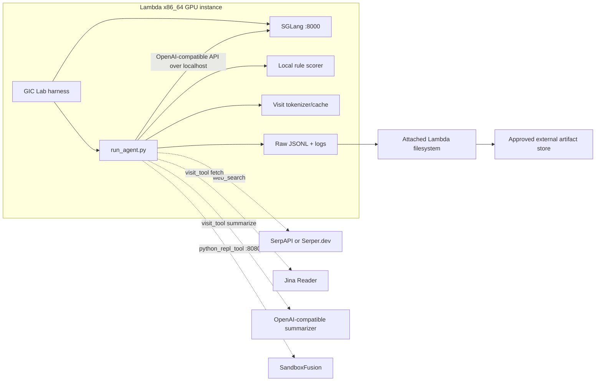

# SR²AM service and storage topology

Status: **static design; not authorized for execution**

Source pin: `sailing-lab/sr2am@6f4ac7824ffc7d12453ffaa53d25e5f34bf3aeb0`

## Decision summary

The minimum model-and-scorer smoke is one x86_64 GPU with at least 40 GB VRAM,
one SGLang process at TP=1/DP=1, one `run_agent.py` process using
`--agent_type instruct`, one `lighteval/MATH` row with a deterministic scorer,
and no search,
summarizer, sandbox, or external judge. This validates checkpoint loading,
serving, generation, raw JSONL capture, and local scoring; it does **not**
validate the released tool-using `think` topology.

The minimum full topology adds SerpAPI or Serper.dev, Jina Reader, an
OpenAI-compatible browsing summarizer, an implicit local tokenizer/cache, and
SandboxFusion. The upstream `think` path constructs every tool before processing
a question, so a pure math task does not remove those configuration
requirements. The model can still call any advertised tool, but it need not do
so; without an observed joined call/result, this is think-path and service
readiness evidence rather than tool-integration evidence. See
[`COMMAND_CONTRACT.yaml`](COMMAND_CONTRACT.yaml) for the two profiles.

## Component graph

Dashed edges are absent from the service-free `instruct` smoke. The local
single-machine wrapper fixes the model client to `localhost`, so SGLang and the
agent are co-located in that wrapper. Direct `run_agent.py` accepts an arbitrary
model base URL, but that is a different lifecycle arrangement and must be
declared explicitly.

## Placement and readiness contract

| Component | Placement | Endpoint or interface | Readiness evidence | Required profile |
|---|---|---|---|---|
| Harness | GPU host | Argument arrays and append-only artifacts | Every required preflight command completes with exit status 0 | Both |
| SGLang model server | Same host under the upstream local runner | `http://127.0.0.1:8000/v1`; upstream binds `0.0.0.0:8000` | Owned PID alive, `/health` returns 2xx, and `/v1/models` contains `SR2AM-v0.1-8B` within 600 seconds | Both |
| Agent/orchestrator | Same host as the local runner | Python process | Process starts; acceptance also requires exit status 0 and the complete raw-row gates | Both |
| Deterministic scorer | In agent Python process | Async `agent_base.judge_answer` through the `lighteval/MATH` dispatcher | Before model use, `\boxed{2}` vs `2` returns `{score: 1.0}` and `\boxed{3}` vs `2` returns `{score: 0.0}`, both without `error` or captured stdout/stderr | Both smoke profiles |
| Search | Remote SaaS; no co-location option in source | SerpAPI HTTPS or Serper.dev HTTPS | Explicit credential-name presence and a T11 dry-run probe; no probe occurred in T02 | Full agent only |
| Page fetch | Remote SaaS | `https://r.jina.ai/<URL>` | T11 dry-run probe; no probe occurred in T02 | Full agent when `visit_tool` is callable |
| Browsing summarizer | Separate OpenAI-compatible endpoint is preferred | User-supplied base URL | Model-list or bounded completion health check defined in T11 | Full agent when `visit_tool` is callable |
| Visit tokenizer/cache | Agent host | Qwen path calls `AutoTokenizer.from_pretrained(summarize_model)`; non-Qwen path uses local `gpt-4o` tiktoken encoding | Approved source patch with immutable tokenizer path/revision, or hash-verified offline cache with network fallback disabled | Full agent at constructor time |
| SandboxFusion | Separate CPU/service host is preferred; same host is possible but not launched by inference wrapper | `http://<host>:8080/run_code` | Verify image digest and package-lock identity, then execute the upstream `print("ok")` readiness request | Full agent when `python_repl_tool` is callable |
| Self-hosted LLM judges | Separately owned OpenAI-compatible services | `MATH_LLM_JUDGE_URL`/`MATH_LLM_JUDGE_MODEL`, `STEM_LLM_JUDGE_URL`/`STEM_LLM_JUDGE_MODEL`, or `WEB_LLM_JUDGE_URL`/`WEB_LLM_JUDGE_MODEL`; source passes literal `EMPTY` as API key | Prohibited in both proposed smokes; any later path must identify and probe the exact endpoint/model revision | Nonselected math, STEM, table, or web dispatcher branches |
| Direct OpenAI judges | Public OpenAI API | `OPENAI_API_KEY`; source hard-codes branch-specific models including `gpt-4.1-mini-2025-04-14`, `gpt-4.1-2025-04-14`, `o4-mini-2025-04-16`, and `o4-mini` | Prohibited in both proposed smokes; any later path needs a separate credential, retry, token, cost, and readiness contract | Nonselected GPT/HLE dispatcher branches |
| Weights & Biases | Remote telemetry | SDK | Disable with `WANDB_MODE=disabled`; it is not evidence storage | Neither |

Process acceptance is conjunctive: valid-looking output does not mask a later
nonzero exit. Every required preflight process, the agent, and the aggregate
evaluator must exit 0; aggregate stdout must also be non-empty. A row flushed
before a crash or any structured error row remains failure evidence.

## Auxiliary lifecycle ownership

Every service must have exactly one T11-declared lifecycle mode and owner. The
search provider and Jina Reader are pre-existing external SaaS: the harness may
probe and call them within budget, close client activity, and record final
counters, but it neither launches nor terminates the provider service. The visit
tokenizer is a mounted read-only artifact, not a daemon. Nonselected evaluator
services remain prohibited.

The browsing summarizer and SandboxFusion each require a T11 choice between
`pre-existing-external-readiness-only` and
`harness-launched-owned-process-or-resource`. The former records the external
owner, endpoint, immutable model/image/package identities, and leaves lifecycle
state untouched. The latter additionally records the owned PID/process group or
provider resource ID, cleanup authority, logs, and billing boundary; cleanup
must perform bounded TERM→KILL or provider termination and poll until terminal
or non-billable. SGLang is always a harness-owned local process group. No
separately launched auxiliary process or resource may survive an attempt or
remain billable.

Source basis: the local wrapper starts SGLang and points the agent to localhost
([`scripts/run_inference_local.sh` lines 214–292](https://github.com/sailing-lab/sr2am/blob/6f4ac7824ffc7d12453ffaa53d25e5f34bf3aeb0/scripts/run_inference_local.sh#L214-L292));
the three tools and their constructors are wired together before question
processing
([`run_agent.py` lines 518–548](https://github.com/sailing-lab/sr2am/blob/6f4ac7824ffc7d12453ffaa53d25e5f34bf3aeb0/run_agent.py#L518-L548));
and the concrete remote endpoints appear in
[`tools/websailor_tools_fast.py`](https://github.com/sailing-lab/sr2am/blob/6f4ac7824ffc7d12453ffaa53d25e5f34bf3aeb0/tools/websailor_tools_fast.py).
For Qwen/Qwen3 summarizers, that same constructor loads
`AutoTokenizer.from_pretrained(summarize_model)` without a revision or separate
local tokenizer path. This is an implicit disk/cache/network dependency, not a
property of the remote endpoint, and the released CLI cannot pin it independently.

Evaluator placement is dispatcher-specific. The math and STEM judge modules
select between a self-hosted OpenAI-compatible client (`*_LLM_JUDGE_URL`,
`*_LLM_JUDGE_MODEL`, and literal key `EMPTY`) and a direct OpenAI client
(`OPENAI_API_KEY`); the web module contains both classes, while the HLE module
creates a direct OpenAI client at import time. None is part of the selected
`lighteval/MATH` local-rule profile, and none may be enabled by ambient
environment inheritance.

## Can math avoid the tool services?

| Path | Search | Jina/summarizer | SandboxFusion | External judge | What it proves |
|---|---:|---:|---:|---:|---|
| `instruct` + `lighteval/MATH` | No | No | No | No | Model loads, serves, answers one row, writes the source JSONL, and reaches a deterministic rule scorer. |
| `think` + pure math | Search credential/config required at startup; call is model-dependent | Valid endpoint plus local tokenizer/cache required at startup; call is model-dependent | Server is not validated at startup, but the tool is advertised and may be called | No for `lighteval/MATH` | Think path and service readiness. Tool integration remains uncovered if the model makes no joined call/result. |
| `think` + released benchmark categories | Yes | Yes for browsing | Yes for code-capable behavior | Often yes | Broader artifact behavior; not a smoke and not authorized here. |

The distinction is enforced by source behavior, not task prose. The search tool
raises during construction when its selected key is absent
([`tools/websailor_tools_fast.py` lines 70–96](https://github.com/sailing-lab/sr2am/blob/6f4ac7824ffc7d12453ffaa53d25e5f34bf3aeb0/tools/websailor_tools_fast.py#L70-L96)).
The runner passes a possibly null summarizer model, while the visit-tool
constructor immediately invokes `.startswith` on it
([`run_agent.py` lines 528–535](https://github.com/sailing-lab/sr2am/blob/6f4ac7824ffc7d12453ffaa53d25e5f34bf3aeb0/run_agent.py#L528-L535),
[`tools/websailor_tools_fast.py` lines 290–311](https://github.com/sailing-lab/sr2am/blob/6f4ac7824ffc7d12453ffaa53d25e5f34bf3aeb0/tools/websailor_tools_fast.py#L290-L311)).
The `instruct` branch is the only branch that creates an empty tool map
([`run_agent.py` lines 499–521](https://github.com/sailing-lab/sr2am/blob/6f4ac7824ffc7d12453ffaa53d25e5f34bf3aeb0/run_agent.py#L499-L521)).

## Startup, readiness, and cleanup

The upstream local wrapper performs these steps:

1. Parse inputs, derive TP/DP, and select 8B defaults: TP=1, DP=`NUM_GPUS`,
   temperature 0.8, 50 turns, and 40,960 context tokens.
2. Source a repository-local `.env` if present.
3. Install an `EXIT INT TERM` trap for the SGLang PID.
4. Start `python -m sglang.launch_server`, redirecting output to the single
   overwrite-prone `logs/sglang_server.log` path.
5. Poll `/health` every 10 seconds for at most 600 seconds and also check that
   the parent PID remains alive. The `curl -s` command omits `--fail`, so any
   HTTP response status can satisfy this source loop.
6. Run `run_agent.py`; optionally print aggregates; then rely on the trap to
   stop the server.

The readiness loop is a useful transport-level starting point
([`scripts/run_inference_local.sh` lines 232–256](https://github.com/sailing-lab/sr2am/blob/6f4ac7824ffc7d12453ffaa53d25e5f34bf3aeb0/scripts/run_inference_local.sh#L232-L256)),
but T11 must replace its status semantics with explicit 2xx health plus model
identity checks. There is no corresponding upstream preflight for search, Jina,
summarizer/tokenizer identity, SandboxFusion, evaluator behavior, W&B, disk
capacity, or artifact upload.

The cleanup comment says “process group,” but the implementation sends signals
only to direct children selected by `pkill -P` and to the recorded parent PID;
it does not create and terminate a dedicated process group, escalate after a
deadline, verify that GPU processes disappeared, or sync artifacts
([`scripts/run_inference_local.sh` lines 201–212](https://github.com/sailing-lab/sr2am/blob/6f4ac7824ffc7d12453ffaa53d25e5f34bf3aeb0/scripts/run_inference_local.sh#L201-L212)).
T11 must therefore own PIDs/process groups, perform bounded TERM→KILL cleanup,
verify GPU process exit, apply the declared cleanup contract to every
harness-launched auxiliary process or resource, sync and hash artifacts, and
terminate the Lambda instance through the provider lifecycle API. A workload
exit is not provider termination. Pre-existing externally owned services are
readiness-only and must not be stopped by this harness.

The wrapper's control precedence is also inverted for three service settings:
it parses `--browsing-summarize-model`, `--browsing-summarize-url`, and
`--code-sandbox-servers`, then sources `.env`, whose same-named values overwrite
the flags. Because the whole `.env` is exported before SGLang starts, the model
server inherits unrelated search/Jina/judge credentials. T11 must launch direct
argument arrays with per-process allowlisted environments and preserve the
resolved values.

## Resource defaults and safe smoke overrides

| Setting | Upstream local default for 8B | Minimum smoke contract | Rationale |
|---|---:|---:|---|
| GPUs | 8 | 1 | Source logic fixes TP=1 and sets DP equal to `--num-gpus`; it has no 8B minimum check. Eight GPUs are the paper-throughput example, not a model-fit minimum. |
| Tensor/data parallel | TP=1, DP=8 | TP=1, DP=1 | One model replica avoids multiplying the approximately 16.4 GB checkpoint. |
| SGLang context | 40,960 | 40,960 | Matches the pinned model config and upstream 8B script. A reduced context would be a deliberate T11 deviation, not silently assumed. |
| Agent concurrency | 64 | 1 | One row and one request keep KV and service demand bounded. |
| Search/visit/code concurrency | 64/64/64 | 0 in `instruct`; 1/1/1 in full-topology smoke | Bounds simultaneous work only; it does not cap array cardinality, tool calls, internal retries, or spend. |
| Turns | 50 | 1 for `instruct`; retain 50 for full-topology parity | `instruct` returns without tools after one response. |
| Completion cap | Wrapper passes 16,384 | `instruct` actually hard-codes 4,096 | The `instruct` implementation ignores the CLI completion setting. |
| Outer question attempts (`--num_retries`) | 1 total attempt in wrapper | 1 total attempt, so no outer retry | Both processing functions loop `range(num_retries)`; direct `run_agent.py` defaults to three total attempts, not three retries. This is distinct from OpenAI SDK retries. |
| Fixed datetime | Off | On | For `instruct`, it stabilizes printed and raw-retained system text but has no model-input effect; for `think`, the system prompt is model input. |
| Sampling | SGLang 0.5.7 defaults to model generation config | `instruct` inherits temperature 0.6, top-k 20, top-p 0.95; `think` overrides temperature to 0.8 and inherits top-k 20/top-p 0.95 | SGLang does not consume the file's `do_sample` key, but both effective profiles remain stochastic and forward no seed. T11 must accept this, validate SGLang's `--enable-deterministic-inference` candidate (batch-invariant operations and seed-42 fallback), or approve another request/source control. |
| W&B | Enabled unless configured otherwise | Disabled | External telemetry is not the evidence ledger. |

### Cardinality and external-spend bounds

Semaphores set to one do not make the full topology budget-bounded. The search
and visit schemas allow arrays without `maxItems`, one assistant turn can emit
multiple tool calls, and the source-parity profile allows 50 turns. The static
per-URL visit control flow can make up to four Jina requests. It can invoke the
summarizer helper once initially, four times in the short-output loop, and three
times in the JSON-parse loop; each helper invocation makes up to ten logical SDK
calls, for at most 80 logical summarizer calls per URL. Pinned `openai==2.6.1`
defaults to two retries, so each logical call can make three HTTP attempts: up
to 240 summarizer wire attempts per URL, subject to the enclosing 300-second
tool timeout. The same SDK default makes one logical model call up to three
HTTP attempts, or up to 150 across 50 logical turns.

T11 must place hard, checked per-run maxima on model calls, assistant tool calls,
search queries, aggregate requested search results, URLs, Jina requests, logical
SDK calls, SDK retry/wire attempts, sandbox requests, model and summarizer
input/output tokens, external API spend, GPU spend, and wall time. T11 must
validate each search `num` as an integer from 1 through 10 (the source default is
10), then increment `search_results_requested` before dispatch by query-array
length times `num` (or one times `num` for a string query). The source schema's
`num` is otherwise an unbounded JSON number, so a per-query value or
provider-side limit cannot replace the cumulative run budget. The harness must
stop before the next call when any remaining budget is insufficient and
preserve each counter.

The `think` loop appends every assistant and tool message without pruning or
compaction. Its nominal 50 turns × 16,384 requested output tokens (819,200) cannot
fit the 40,960-token server context, and search/visit results further grow the
input. The model input count must be the exact server-accounted or pinned
server-rendered prompt, including chat-template/control tokens, every outbound
message, and every tool schema; for `instruct`, it is the rendered user-only
request. The summarizer count must likewise cover its exact rendered request,
not the source's approximation that tokenizes only `msgs[0]["content"]` plus
one. Before every model or summarizer call, T11 must reserve the requested output
allowance and stop before the context or run-level token budget is exceeded. If
exact rendering/accounting is unavailable, the gate is blocked. Any truncation,
compaction, smaller completion cap, or turn reduction is an explicit protocol
deviation.

The model memory lower bound is approximately 15.256 GiB of BF16 weight files
plus 5.625 GiB for one fully occupied 40,960-token BF16 KV cache, or 20.881 GiB
before CUDA graphs, activations, allocator reserve, and server overhead. The KV
estimate is derived from 36 layers × 2 (K and V) × 8 KV heads × 128 head
dimension × 2 bytes × 40,960 tokens. It is not a measured peak. A 40 GB A100 is
therefore a conservative static floor for this exact-context, one-request smoke;
80 GB H100 remains preferred for headroom and lower setup risk.

## Time and cost envelope

These are planning estimates, not observed runtime evidence. They must be
replaced or annotated with measurements after an authorized smoke.

| Segment | Cold-cache planning range | Basis and stop gate |
|---|---:|---|
| Environment setup | 15–45 min **after** T11 produces a validated x86 lock/image | The current 349-line snapshot is internally inconsistent and is not time-budgetable as-is. Abort on any lock/import smoke failure. |
| Full-topology auxiliary setup | Unbounded until T11 supplies new contracts | The visit tokenizer lacks a revision/path surface, while the sandbox uses an unpinned image plus 256 unversioned packages installed one-by-one. This segment is excluded from the service-free total. |
| Checkpoint download and checksum | 7–27 min | Pinned repository is 16,398,028,091 bytes. At 100/250/500 Mbit/s, raw transfer is about 21.9/8.7/4.4 min; add checksum and metadata overhead. Abort on shard size/hash mismatch. |
| SGLang model readiness | 2–10 min | Static estimate bounded by the source's 600-second readiness timeout. |
| One `instruct` generation plus local score | 0.5–6 min | One logical model SDK call, which can make up to three HTTP attempts under `openai==2.6.1`; the client timeout is 300 seconds and the enclosing `generate_response_timeout` is 360 seconds, followed by local scoring and JSONL flush. |
| Artifact hash and transfer | 1–5 min for a ≤100 MiB smoke bundle | Includes logs, JSONL, resolved config, and checksums; abort if durable hash verification fails. |

The service-free summed cold range is approximately 25.5–93 minutes once the
environment is actually validated. There is no defensible full-topology sum
until its auxiliary setup is pinned and dry-run measured. At the 2026-08-07
public 1× H100 PCIe list price of
USD 3.29/GPU-hour, that is roughly USD 1.40–5.10 before tax and persistent
storage. A two-hour instance ceiling would be USD 6.58 before those additions;
it is a planning bound, not authorization. Lambda pricing is mutable and must be
re-read at T11 and again at launch from the
[official instances page](https://lambda.ai/instances).

## Storage ownership

Lambda documents that attached filesystems are regional persistent storage,
must be attached when the instance is created, and mount beneath
`/lambda/nfs/<FILESYSTEM_NAME>`
([Lambda filesystem documentation](https://docs.lambda.ai/public-cloud/filesystems/)).
Lambda also states that all local, non-filesystem data is destroyed when an
on-demand instance is terminated
([import/export documentation](https://docs.lambda.ai/public-cloud/importing-exporting-data/)).

The proposed ownership contract is:

| Data | Primary location during run | May use root/local SSD? | Required before termination |
|---|---|---:|---|
| Pinned checkpoint and primary-model tokenizer | Attached Lambda filesystem, keyed by model revision | Yes, as a disposable staged copy | Verify every published shard size/SHA-256 on durable storage. |
| Visit tokenizer/cache | Attached filesystem, keyed by an independent immutable artifact identity | Yes, as an active read-only cache | Verify hashes before construction and disable unexpected network fallback; the current source needs an approved patch or explicit cache contract. |
| Sandbox image and package environment | Attached filesystem or external registry, keyed by image digest and package-lock hash | Yes, as a staged runtime | Replace the unpinned tag and 256 unversioned names; prove every required package installed and preserve the identities. |
| Validated environment lock, wheelhouse, or image identity | Attached filesystem plus tracked small lock/manifest | Yes, for the active venv/cache | Record hashes and architecture; preserve the reusable cache. |
| Upstream source clone | Root disk, detached at the pinned commit | Yes | Preserve commit/tree identity and any patch as a small artifact; source is reproducible from Git. |
| SGLang cache and temporary files | Root/local SSD | Yes | No retention unless needed to diagnose failure. |
| Raw JSONL, stdout/stderr, server logs, resolved commands, resource samples | Write locally for performance and copy continuously or at milestones to attached filesystem | Only with an active sync/stop guard | Flush, hash, copy, and verify on the filesystem and approved external artifact store. |
| Sandbox working state | Sandbox host ephemeral storage | Yes | Retain only declared raw tool request/response evidence; never retain credentials. |

Repository policy fixes the minimum local free-space floor; it is not an open
T11 budget choice. Every local or attached filesystem that can receive these
writes must retain at least 150 GB or 20% of its capacity free, whichever is
greater ([`docs/STORAGE_POLICY.md`](../../STORAGE_POLICY.md)). Preflight must
subtract declared worst-case writes before accepting the run, and runtime
monitoring must stop before the next write or download could cross that floor.
T11 may set a stricter threshold but never a weaker one.

The attached filesystem is durable across instance termination but is still a
single regional provider copy and continues billing while it exists. Evidence
is not complete until selected artifacts are checksum-verified in an approved
external destination. T11 must select that destination and retention rule; T02
does not create or attach storage.
