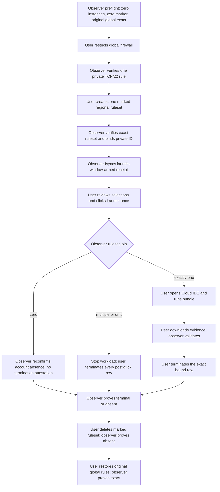

# T07 Gate L2M user runbook

Status: **blocked draft; do not execute**

This runbook is the reviewed human-factors sequence for a possible future Gate L2M.
It is not executable authority. There is no approved image decision, plan, run,
authorization, instance, or billable window. Do not perform any step until a later
packet explicitly replaces this status and binds every placeholder.



## Before any future mutation

The later operator must first report that the private human decision is valid and
sealed, the account has zero running instances, current price/capacity and the
selected image remain exact, the marker has zero ruleset matches, the current global
firewall equals its just-sealed original snapshot, the external archive/storage floors
pass, and all observer budgets are reserved. The user must be present continuously.
Before changing any firewall or cloud resource, open the launch wizard without
submitting it, choose `gpu_1x_a10` and `us-east-1`, and confirm that the privately
approved Lambda Stack alias/version is actually in the offered image list. The pinned
sources do not prove this type-to-image relationship. If it is absent, exit without
launching, make no mutation, and stop `approved_image_not_offered`; do not substitute
an alternate.

## Exact user-only sequence

1. In Lambda Cloud console, open **Firewall → Global rules → Edit rules**. Replace
   the rules with exactly one custom TCP rule: port `22`, the privately supplied
   current public IPv4 `/32`, and the bounded T07 description. Submit once. Write the
   fresh `global_firewall_restricted` private checkpoint with
   `global_firewall_restricted: true`. Wait for observer approval.
2. Open **Firewall → Rulesets → Create new ruleset**. Use the exact private marker
   name supplied for this run, region `us-east-1`, and exactly the same one TCP/22
   private `/32` rule. Create once. Write `regional_ruleset_created`. Wait for the
   observer to bind exactly one ruleset privately. Its checkpoint detail is
   `regional_ruleset_created: true`.
3. Open **Instances → Launch instance** and choose exactly:
   `gpu_1x_a10`; `us-east-1`; approved `Lambda Stack 22.04` alias/version;
   **Don't attach a filesystem**; `fractal-lambda-codex`; and the exact run-owned
   regional ruleset. Reconfirm the approved alias/version is offered for this exact
   type/region and verify every row before proceeding. If offeredness differs from the
   non-mutating preflight, exit without clicking Launch and use the firewall/ruleset
   cleanup path.
4. Stop at the final review screen. The observer must call `arm_launch_window()` and
   durably confirm `launch_window_armed` before the user is permitted to click. If the
   observer does not confirm, do not click and restore/delete through the cleanup path.
5. Accept the displayed provider terms only if they match the later authorization.
   Click **Launch instance exactly once**. Never click again after uncertainty. Write
   `launch_clicked_once` with `launch_clicked_once: true`,
   `approved_image_offered_for_selected_type_region: true`, the observer-supplied
   private `launch_configuration_sha256`, and a fresh nonce. This checkpoint is not
   proof of launch; wait for observer binding.
6. This sequence is valid only while the private decision's exclusive Lambda-account
   instance-mutation window remains true. If the observer reports zero post-click
   rows, stop and follow cleanup. If it reports an additional, unattached, or drifting
   row, run no workload and stop for human identity review; the attested exclusive
   window is the only basis for treating every post-click row as T07 cleanup scope.
   Proceed only after exactly one instance is privately classified as active/booting
   with the expected type, region, key, no-filesystem state, and image-selection
   checkpoint. The observer then supplies the private `instance_binding_sha256`; write
   a fresh `instance_bound` checkpoint with `instance_bound: true`, that hash, and a
   fresh nonce, with no raw provider identifier. Do not open Cloud IDE until the
   observer consumes and durably confirms that binding checkpoint.
   A zero-row result has a different truthful cleanup path: do not click Terminate and
   do not write `termination_confirmed_by_user`. The observer must make a fresh
   account-wide instance observation; if it again proves zero rows, write only
   `instance_terminal_verified` with `terminal_or_absent: true` and the supplied
   `zero_match_stop_and_terminate` state, then continue with regional-ruleset deletion.
   For multiple, unattached, or drifting rows, run no workload. Because the sealed
   preflight proved an account-wide zero baseline and the private decision grants an
   exclusive instance-mutation window, select every post-click console row reported
   in the incident and complete the termination flow for each before writing one
   `termination_confirmed_by_user` checkpoint. If either premise is no longer true or
   any row cannot be accounted for, preserve the strict firewall and remain in a
   manual incident; do not restore it or infer an exact bound row.
7. For the bound row, click **Cloud IDE → Launch**. Do not change the firewall or open
   another port. Wait no more than 600 seconds. On success, write
   `cloud_ide_opened` with `cloud_ide_opened: true`. On failure, immediately use
   cleanup with disposition `cloud_ide_unavailable_under_strict_firewall`.
8. Upload the complete directory represented by
   `containers/sira-smoke/lambda/manual-console/manifest.json`. In a Jupyter terminal,
   proceed only after the later materializer has refreshed and reviewed the
   manifest-bound public BusyBox observation; the driver rejects an observation older
   than 86,400 seconds before making any Docker call and makes no separate metadata
   request itself. The manifest binds that record alongside the executable files.
   In the terminal,
   run only the exact later-authorized array emitted by
   `qualification_bootstrap_arguments()`. It begins with
   `/usr/bin/python3`, `-I`, `-S`, `-c`, the repository-pinned `BOOTSTRAP_SOURCE`, the
   exact expected driver SHA-256, and the absolute driver path; only then may the
   following driver arguments appear:

   ```text
   qualification_driver.py
     --run-id <fresh-authorized-run-id>
     --decision-alias <private-bound-public-alias>
     --marker-alias <private-bound-public-alias>
     --instance-binding-sha256 <private-instance-binding-sha256>
     --authorization-reference <exact-later-authorization-reference>
     --authorization-sha256 <exact-later-authorization-sha256>
     --bundle-manifest-sha256 <exact-later-bundle-manifest-sha256>
     --output-dir <fresh-exact-Jupyter-output-directory>
   ```

   Direct `python3 qualification_driver.py` execution is forbidden because it skips
   hash-first held-file verification and isolated mode. The later plan must supply the
   complete bootstrap as an argument array, not a shell string. Write
   `qualification_command_started` with `qualification_command_started: true`. Wait
   at most 300 seconds for the single `T07_L2M_QUALIFICATION=success` or `failed`
   line. Do not repair Docker, install a package, use SSH, or rerun. As soon as that
   single line appears, write `qualification_command_completed` with
   `qualification_command_completed: true`; if no line appears within 300 seconds,
   stop and begin cleanup.
9. Within a separate 300-second window beginning at the accepted
   `qualification_command_completed` checkpoint, download the named success or failure
   evidence ZIP through Jupyter and place it
   only at the later plan's fresh Mac mini inbound path. A failed line with
   `cleanup_incident=true` means container cleanup is unproven and makes immediate
   console termination mandatory. Do not rename, unpack, or edit either archive before
   observer validation. For a success ZIP only, first let the observer validate it and
   then write `qualification_bundle_downloaded` with
   `qualification_bundle_downloaded: true` and its private
   `qualification_archive_sha256`. For a failure ZIP,
   let the observer validate the typed failure disposition, do **not** create the
   inapplicable bundle-downloaded checkpoint, immediately resume cleanup/termination,
   and never rerun the command. A failure archive can never satisfy qualification.
   If the line instead says `evidence_archive=unavailable`, no archive exists to wait
   for or attest: create no bundle-download checkpoint, preserve any bytes already
   present without editing them, enter incident/cleanup-only state, terminate the
   provider instance immediately, and never rerun the command.
10. On the normal exact-one path, select only the exact bound instance row. Click
    **Terminate**, enter the documented confirmation phrase `erase data on instance`,
    and click **Terminate instances**. On a multiple/unattached/drift incident, use the
    branch in step 6 and perform that same confirmation flow for every post-click row;
    there is no exact bound row in that branch. Only after all required termination
    clicks, write `termination_confirmed_by_user` with
    `termination_confirmed_by_user: true`. On the twice-observed zero-row branch, skip
    this step and never create a false termination checkpoint. Never use host shutdown
    or poweroff.
11. Wait for the observer to prove the exact instance terminal or absent and supply
    the private `launch_identity_state`. Then write `instance_terminal_verified` with
    `instance_terminal_verified: true`, `terminal_or_absent: true`, and that supplied
    state. Until this proof, do not restore the original global firewall.
12. Delete only the unique run-owned regional ruleset in the console. After read-only
    absence proof, write `regional_ruleset_deleted` with
    `regional_ruleset_deleted: true` and `regional_ruleset_absent: true`.
13. Restore the exact sealed original global rules in the console. After exact
    semantic verification, write `global_firewall_restored` with
    `global_firewall_restored: true` and the observer-supplied sealed
    `global_firewall_semantic_sha256`; then wait for sealed archive completion.

## Checkpoint contract

Each checkpoint is a new file under the later run's exact private checkpoint root,
current-user owned, mode `0600`, one link, no symlink, at most 16,384 bytes, created
inside its 300-second challenge window, and never reused. It carries only the schema's
run/decision/marker aliases, fresh nonce, UTC time, action attestation, and necessary
private binding. Never paste a raw resource ID, source IPv4, Jupyter URL/token, or
private path into chat, Git, or public output.

The observer holds one exclusive, append-only private consumption ledger for the run,
fsyncs every accepted checkpoint before transition, and caps it at 262,144 bytes.
One uninterrupted observer process is mandatory. A process exit, crash, or session
loss permanently burns the live run: immediately terminate every run-owned instance
in the console, retain the strict firewall until terminal state is visible, remove the
run-owned ruleset, restore the sealed original global firewall, and preserve all local
bytes. Any later read-only verification and evidence sealing needs a fresh separately
reviewed recovery run and authorization; the old run/checkpoints are never resumed or
replayed.

A control-plane outage lasting past an active observer cap is likewise a blocker, not
a same-run recovery feature. The user performs console cleanup; Codex does not infer
authority for a new verification run.

## Deadline and incident rule

The normal user must click Terminate no later than 1,800 seconds after Launch. Allow
up to 600 seconds for terminal proof and 300 seconds for firewall cleanup. The hard
provider wall is 3,600 seconds; modeled list cost is USD 0.65 at 1,800 seconds,
USD 0.86 at 2,400 seconds, and USD 1.29 at 3,600 seconds before tax, under the USD 2.00
ceiling. A console/control-plane outage can defeat both local ceilings. During an
outage, keep the strict TCP/22-only firewall, launch nothing else, preserve evidence,
and resume console termination as soon as access returns.
