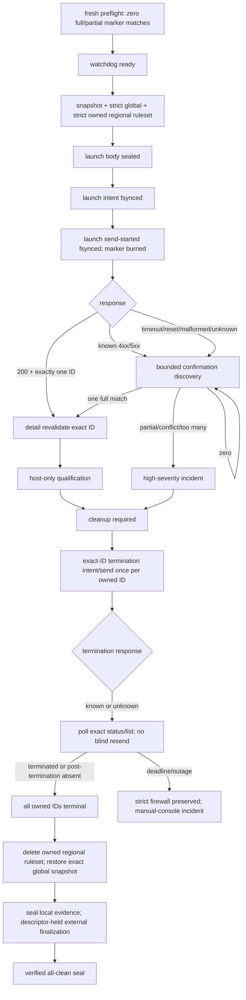

# T07 Gate L2.1 owned-launch recovery and supervisor design

Status: **manual-console-launch-required; automated API-launch design terminated;
unauthorized**

Date: 2026-08-10

This document records the final offline Gate L2.1 decision. It does not grant Lambda
access, cloud mutation, paid compute, SSH, container use, model/API access, browser
use, SiRA execution, or scientific execution. Independent review found useful control
primitives but no authoritative live supervisor/watchdog composition. The terminal
state is `manual-console-launch-required`; there is no executable plan or
authorization block. The rejected V1 and unmaterialized V2 plan/run identities are
non-reusable.

## Exact starting and scientific boundary

- Branch: `phase-1/sira-smoke-lambda`.
- Required clean baseline:
  `1a72670d2c5ee35566b66bcccbbf15e0942e5b1f`.
- Existing private Gate L2.0 decision: revalidated as a current-user-owned,
  mode-`0600`, no-follow regular file; 1,047 bytes; SHA-256
  `0b109b0150eec8739e30e86e5f1318b60c818cc3974354c67dc35a4e2dffd4ea`.
- Last sealed inventory: zero running instances.
- Gate L2 remains infrastructure qualification only.

The following scientific fields remain byte-locked and unchanged:

```text
EXP-0001
PLAN-EXP0001-SMOKE
SIRA-REACTIVE first
SIRA-SIMULATIVE second
PAIR-EXP0001-SMOKE-0000
gpt-4o-2024-11-20
directional reproduction
interpretation_allowed: false
pilot unauthorized
training false
```

## First-party source adjudication

The public, unauthenticated Lambda OpenAPI source is:

| Field | Exact observation |
|---|---|
| URL | `https://docs-api.lambda.ai/api/cloud/spec.json` |
| API version | `1.10.0` |
| OpenAPI version | `3.1.0` |
| Retrieved | `2026-08-10T21:14:56Z` |
| Bytes | 240,288 |
| SHA-256 | `320f4877924984f060b179e86595ed58918a1d0696b60b99cae548ec164934f4` |
| Launch idempotency | No key, header, or token is documented |
| General request rate | One request per second |
| Launch request rate | One per 12 seconds or five per minute |

Canonical hashes of the launch request/response, `Instance`, status enum, list/detail,
terminate, tag, and ruleset-entry schema extracts are recorded in
`containers/sira-smoke/lambda/public-source-observations-l2-1.json`.

The contract supports `name`, `hostname`, and `tags` on launch and returns those
fields on `Instance` when present. It also exposes region, type, SSH-key names,
firewall-ruleset IDs, filesystem state, status, and instance ID. The fields used for
the marker are optional and are not documented as unique. The response does not
expose the launch image, so image identity remains sealed launch-request evidence and
is never claimed as a discovery field.

Lambda's public billing documentation says billing ends when an instance is
terminated and that instances remain billable while running. Its instance-management
documentation says host shutdown/poweroff is not provider termination and billing
continues. Therefore success requires provider status `terminated` or verified
post-termination disappearance from the API's documented running-instance set; host
shutdown is never terminal proof.

## Private owned-launch marker

The future private materialization generates 32 random bytes; implementations reject
fewer than 20 bytes (160 bits). The seed is domain-separated through HMAC-SHA-256 and
bound to all of:

- plan ID and plan SHA-256;
- authorization reference;
- instance type and region;
- selected image identity hash;
- selected SSH-key identity hash;
- selected regional-ruleset identity hash;
- the sealed Gate L2.0 human-decision hash; and
- the fresh launch-recovery decision seal hash.

The HMAC output yields a 32-lowercase-hex-character opaque fragment. The exact visible
shape is:

```text
name:     t07-<32 lowercase hex>
hostname: t07-<32 lowercase hex>
tag 1:    giclab-owner=<same 32 lowercase hex>
tag 2:    giclab-purpose=t07-host-qualification-<same 32 lowercase hex>
```

These values satisfy the current 64-character name, 63-character hostname, 55-
character tag-key, 128-character tag-value, hostname-pattern, and tag-key-pattern
limits. Only lengths, field shapes, key names, binding hash, and marker hash may enter
public evidence. The seed, fragment, exact fields, complete body, and raw resource IDs
remain under an ignored private run root and are copied only into sealed private
evidence.

A marker is permanently burned at `launch_send_started`, regardless of response
outcome. Neither the marker nor the run identity may be retried.

## Exact ownership predicate

`owned_instance_match` requires the conjunction below from one parsed `Instance`:

```text
exact name
exact hostname
exact giclab-owner tag
exact giclab-purpose tag
exact region name
exact instance type name
exact one-element SSH-key-name list
exact one-element firewall-ruleset-ID list
empty file_system_names
absent-or-empty file_system_mounts
status in {booting, active, unhealthy, terminated, terminating, preempted}
```

An IP address is never an ownership input. An absent image is not a mismatch because
the official `Instance` schema does not return image identity.

Prelaunch requires zero full matches, zero partial marker signals, and zero complete
marker-with-conflicting-details rows. After discovery identifies a candidate, exact
`GET /instances/{id}` detail must repeat the full conjunction before the ID becomes an
authoritative cleanup target.

Outcomes are closed and typed:

| Observation | Result | Allowed action |
|---|---|---|
| Zero marker signals | `owned_instance_not_yet_visible` | Continue only inside the current phase cap |
| One exact full match | `owned_instance_discovered` | Detail-revalidate, then bind exact ID |
| Multiple exact full matches | `provider_duplicate_owned_instances` | Terminate all only if separately approved and count <= 4 |
| Partial marker | `ownership_collision_or_drift` | Incident; never terminate it |
| Full marker with conflicting bound detail | `owned_instance_conflicting_details` | Incident and human review |

## Launch, discovery, and termination state machine

The diagram below is the intended policy model exercised with fakes. The transaction
journal primitive is exclusive-create, append-only, schema-validated, and
fsync-backed, and the body helper seals bytes and SHA-256 before a modeled launch
intent. Independent review established that no live runner authoritatively composes
these primitives, so the diagram is not an execution contract.



One known 4xx/5xx is evidence, not permission to retry; discovery still confirms that
no accepted launch became visible. An unknown launch outcome never becomes a normal
failure. If no exact owned instance can be resolved before the incident ceiling, the
system keeps the strict firewall state, prohibits another launch, seals a
`possible_orphaned_launch` incident, and invokes only the separately approved manual
console fallback.

Termination targets only exact IDs returned by the launch response and detail-
revalidated, or found by the full predicate and detail-revalidated. Every ID gets at
most one normal termination send. An unknown termination response triggers status
polling, never blind resend. Global restoration is impossible until all bound IDs
have terminal proof.

## Offline supervisor primitives and review result

`giclab.harness.lambda_l2_supervisor.GateL2Supervisor` models transitions for:

```text
preflight -> watchdog readiness -> firewall transaction -> launch -> discovery/bind
-> Jupyter checkpoint -> SSH/host inspection -> containment -> evidence transfer
-> exact-ID termination -> ruleset deletion -> global restore -> archive finalization
```

The offline helpers validate:

- exact plan/run/authorization/commit and both private decision seals;
- one in-process HTTPS boundary at `cloud.lambda.ai`, with no redirect or retry;
- one shell-free, exact-executable, bounded process boundary;
- a process-local aggregate budget plus a separate fsync-backed budget primitive;
- durable intent/send/result events for provider mutations;
- one launch and a maximum four exact-ID incident terminations;
- selected cleanup transitions after modeled failures;
- mandatory private projection that drops Jupyter token/URL fields;
- public projection with aliases/counts/hashes only; and
- a success-evidence predicate requiring transaction/watchdog/private/evidence hashes,
  terminal proof, zero owned residue, exact firewall restoration, secret scan,
  retained source, destination hash verification, fsync, and atomic finalization.

The evidence archive does verify the final directory through the descriptor originally
opened on the staging directory. That descriptor remains bound after the atomic
rename, avoiding a post-guard path reopen.

Independent review found the composition unsafe as live authority:

- the generic provider helper is not phase-specific and can issue nonlaunch
  operations outside one enforced orchestration sequence;
- firewall mutation/restoration and archive finalization can be asserted through state
  methods without those methods performing and verifying the corresponding effects;
- exceptions after mutation do not all enter an authoritative cleanup runner;
- the fsync-backed cross-process budget is not the budget shared by the modeled
  supervisor and watchdog, so forked cleanup cannot prove aggregate enforcement;
- the mutation lease is a standalone primitive rather than an invariant enforced by
  both effecting boundaries;
- the watchdog has no reviewed live entrypoint binding credential transfer, provider
  transport, expected ownership marker, shared budgets, recovery loops, and evidence
  sealing; and
- the takeover model sends TERM/KILL without an integrated timed grace-loop and does
  not prove an independently surviving cleanup authority.

These are architectural gaps, not missing tests around a complete runner. Fake tests
validate individual control primitives only; they do not prove provider, kernel,
process-survival, billing, SSH, containment, transfer, or cleanup behavior. Gate L2.1
therefore does not create an executable automated plan. D-027 is also enforced in
code: the repository's concrete HTTPS boundary, subprocess boundary, and watchdog
spawn fail before opening a connection, invoking `Popen`, creating pipes, or forking.
Only injected fakes can exercise the retained state helpers.

## Independent watchdog decision

Three first-party mechanisms were evaluated:

| Candidate | Source-grounded property | Decision |
|---|---|---|
| `launchd` plist job | `KeepAlive`, crash restart, TERM-to-KILL `ExitTimeOut`, and default process-group cleanup are documented | Rejected for this transaction: a restarted job cannot reacquire the deliberately nonpersisted API key after simultaneous failure without adding a new secret-storage service |
| `launchctl submit` | Submits a no-plist command and keeps it alive after failure | Rejected for the same credential-reacquisition gap and weaker configuration/evidence surface |
| Separate-session double-fork | POSIX session isolation plus anonymous inherited descriptors; no installed service | Retained as an offline prototype only; rejected as authoritative cleanup because no integrated independently supervised runner exists |

The prototype bootstrap would start before the first firewall mutation. Its helpers
model double-forking, `setsid`, and a length-prefixed anonymous credential pipe. A
separate anonymous pipe models primary-liveness EOF and another readiness. No test
places a credential in argv, an environment list, a plist, a path, a log, or disk.

The prototype includes a run-owned kernel `flock` mutation lease and a ten-second
stale-heartbeat policy. It is not wired into both live effect boundaries, and no
reviewed runner performs the timed TERM/KILL/exit/lease sequence. It therefore cannot
support a claim that only one process can mutate provider state after failure.

The modeled watchdog allowlist contains only list/detail discovery, exact-ID termination,
terminal polling, deletion/absence verification of the owned regional ruleset, and
restoration/verification of the sealed global snapshot. It cannot launch, use SSH,
run a command/container/workload, widen firewall access, or touch unrelated resources.

## Watchdog limits and terminal consequence

The fake-tested pieces do not establish that a watchdog survives and completes an
ordinary primary-process failure. Even a fully integrated local watchdog could not
create an absolute termination guarantee: Mac power loss, local network loss, a
Lambda API and console outage, or simultaneous supervisor/watchdog failure can prevent
cleanup. Because the independent boundary is not source-grounded and implemented as
one live authority, the automated API-launch design terminates at
`manual-console-launch-required`.

## Exact numeric caps

These are bounded design values validated by offline tests. They are not authorized
limits because no executable plan exists.

### Time and cost phases

| Phase | Cap | Basis |
|---|---:|---|
| Initial launch response | 30 s | One bounded in-process request |
| Normal discovery | 300 s | 25 list polls at 12-second spacing |
| Qualification/provider wall | 3,600 s | Existing human ceiling |
| Jupyter host-key checkpoint | 600 s | Existing human ceiling, inside qualification wall |
| Post-failure discovery/cleanup | 1,800 s | 150 list-poll slots at 12-second spacing |
| Manual-console response | 900 s | Separate human decision |
| Absolute automated incident ceiling | 5,400 s | Qualification plus bounded cleanup |

At the observed USD 1.29/hour list price, 3,600 seconds projects to USD 1.29 and
5,400 seconds projects conservatively to USD 1.94. The normal authorized cost ceiling
remains USD 2.00. Cleanup and termination take priority over the nominal cost cap.
During a provider/control-plane outage, elapsed billable time cannot be hard-capped;
that is the separately acknowledged residual exposure.

### Provider and journal caps

| Category | Exact cap |
|---|---:|
| Aggregate provider calls, primary plus watchdog | 420 |
| Read-only preflight | 7 |
| Firewall mutations | 4 |
| Firewall verifications | 4 |
| Launch sends | 1 |
| Normal discovery list/detail | 25 / 5 |
| Active status polls | 30 |
| Incident discovery list/detail | 150 / 20 |
| Exact full-marker owned IDs | 4 |
| Exact-ID termination sends | 4 |
| Terminal status polls | 160 |
| Final zero-owned list | 1 |
| Automatic retry / pagination | 0 / 0 |
| Provider response per call / aggregate | 1,048,576 B / 67,108,864 B |
| Provider request body | 65,536 B |
| Primary journal events / event / bytes | 4,096 / 4,096 B / 16,777,216 B |
| Watchdog journal events / event / bytes | 4,096 / 4,096 B / 16,777,216 B |
| Heartbeats / heartbeat file | 2,700 / 524,288 B |

### Process, containment, and evidence caps

| Category | Exact cap |
|---|---:|
| Shell-free process calls | 128 |
| Process output per call / aggregate | 1,048,576 B / 33,554,432 B |
| TCP readiness probes | 30 |
| SSH-agent / keyscan calls | 1 / 1 |
| SSH sessions / remote commands / transfer calls | 33 / 33 / 33 |
| Docker calls | 24 |
| Containers | 1 |
| Container wall / retained output | 30 s / 16,777,216 B |
| Remote evidence / transfer | 62,914,560 B / 62,914,560 B |
| Mac active evidence / external archive | 67,108,864 B / 67,108,864 B |
| Archive copies | 1 |
| Mac incremental bytes | 135,266,304 B |
| Mac prewrite / retained floor | 8,725,200,896 B / 8,589,934,592 B |
| External retained / precopy floor | 200,048,192,717 B / 200,115,301,581 B |
| Persistent filesystems | 0 |
| Model calls/tokens/cost | 0 / 0 / USD 0 |
| Browser actions / SiRA / science | 0 / 0 / 0 |

These values were intended to be shared across primary and cleanup paths. Review found
that the modeled processes actually receive separate in-memory budgets and do not use
the fsync-backed budget through one compatible interface; many subcaps also remain
unenforced. Consequently these numbers are design values, not a live cap contract.

## Historical private launch-recovery decision design

The repository template is
`containers/sira-smoke/lambda/T07_L2_LAUNCH_RECOVERY_DECISION_TEMPLATE.json`; the
schema is `schemas/t07-lambda-l2-launch-recovery-decision.schema.json`.

The template records the decisions that the rejected automated design would have
needed. The user should not materialize it to authorize this design: completing that
file cannot turn the offline primitives into a live supervisor or create execution
authority. A future human-operated console-launch proposal, if requested, requires a
new and separately reviewed private decision contract.

The exact acknowledgment is:

> The Lambda API does not document launch idempotency. A unique name/hostname/tag
> marker plus prelaunch zero-match check and exact-ID discovery provides strong
> ownership evidence but cannot guarantee cleanup during a prolonged Lambda API and
> console outage, Mac power/network loss, or simultaneous supervisor/watchdog failure.
> In those cases a billable instance may remain until control-plane access is restored.

## Terminal decision and current authority

Independent specification, privacy, cloud-safety, incident-recovery, and
exactly-once-semantics review concluded that the implementation is not technically
complete enough for an automated API-launch plan. The exact terminal decision is:

```text
manual-console-launch-required
```

No executable V2 plan was created. The draft identities
`PLAN-T07-GATE-L2-LAMBDA-HOST-QUALIFICATION-V2` and
`RUN-T07-L2-LAMBDA-HOST-QUALIFICATION-0002` appear only in offline fixtures and are
non-authorizing and non-reusable. No plan path, bytes, SHA-256, or ready-to-copy
authorization block exists.

A future Gate L2 may proceed only under a newly reviewed, human-operated console
launch and cleanup topology with fresh identities and fresh current-turn authority;
this task does not design or authorize it. No account request or real secret access,
cloud mutation, paid compute, SSH, container, browser, model, SiRA, or scientific
action occurred.
